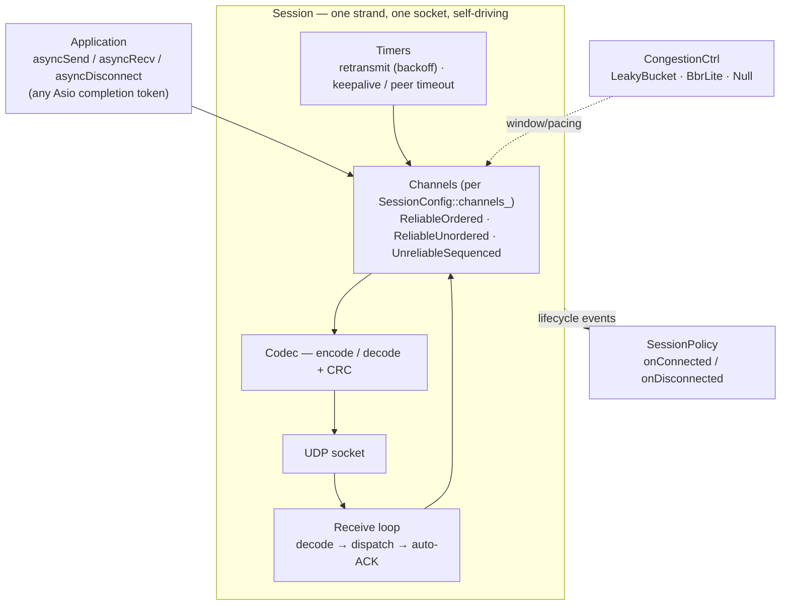
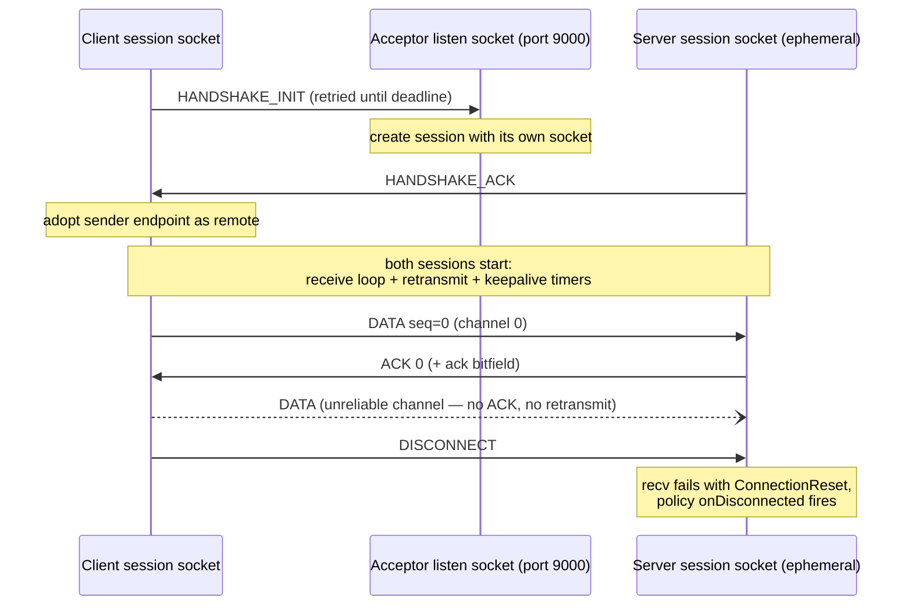

# rude

`rude` is a C++23 Reliable UDP Engine built on Boost.Asio.

The public API is three types — `Acceptor`, `Connector`, and `Session` — and
five calls: `asyncAccept`, `asyncConnect`, `asyncSend`, `asyncRecv`, and
`asyncDisconnect`. Every operation accepts any Asio completion token
(`use_awaitable`, callbacks, `use_future`, `deferred`). Codec, congestion
control, lifecycle policy, and transport are template policy points with
sensible defaults, so the simple path stays simple and the extension path
stays open.

## Quick Start

```cpp
#include <rude/rude.hpp>

// Server
rude::Acceptor acceptor{executor, {asio::ip::udp::v4(), 9000}};
auto session = co_await acceptor.asyncAccept(asio::use_awaitable);

// Client
rude::Connector connector{executor};
auto session = co_await connector.asyncConnect(serverEndpoint, asio::use_awaitable);

// Both sides (channel 0 is a reliable ordered channel by default)
co_await session->asyncSend(0, payload, asio::use_awaitable);
auto n = co_await session->asyncRecv(0, asio::buffer(buf), asio::use_awaitable);
co_await session->asyncDisconnect(asio::use_awaitable);
```

Sessions are `std::shared_ptr` and fully self-driving: each one owns its UDP
socket and runs its own receive loop, retransmission timer, and
keepalive/timeout timer on a per-session strand. See
`examples/SessionLoopback.cpp` for a complete runnable round trip.

## Architecture

Everything a session needs lives behind its strand; the four template policy
points on the right are how the library is extended without touching the core.



Swap any of the policy points by satisfying its concept: `PacketCodec` (wire
format), `CongestionCtrl` (pacing/window), `SessionPolicy` (lifecycle
callbacks), `Socket` (transport / test doubles).

### Connection establishment

The acceptor answers each handshake from a fresh per-session socket, so the
listen socket only ever sees handshakes and established sessions never contend
for it (the same rendezvous pattern TFTP uses):



If the ACK is lost, the client's retried INIT reaches the server session
socket directly and is re-acknowledged from there, so the handshake heals
without involving the acceptor again.

## Current Status

Implemented and covered by tests:

- Connector/acceptor lifecycle with retrying, deadline-bound handshake
- Socket-per-session accept model (the listen socket only ever sees handshakes)
- Session receive loop with automatic ACKs and peer/keepalive timeout detection
- Automatic retransmission with per-packet exponential backoff (Karn-aware RTT sampling)
- Default packet codec with CRC validation
- Reliable ordered channel delivery
- Reliable unordered channel delivery with duplicate suppression
- Unreliable sequenced delivery
- ACK bit tracking and sequence wraparound helpers
- Sliding-window and reorder-buffer helpers
- Token-bucket and BBR-lite congestion controllers
- Socket statistics snapshots (including a smoothed RTT estimate)
- End-to-end loopback session test plus component tests (Boost.UT / CTest)

Not yet implemented:

- Payload fragmentation (sends above the MTU fail with `Error::MessageTooLarge`)
- Encryption or peer authentication — the handshake is unauthenticated
- Connection migration / NAT rebinding

## Requirements

- CMake 3.28 or newer
- A C++23-capable compiler
- vcpkg
- Boost.Asio, resolved through `vcpkg.json`
- Boost.UT for tests, resolved through the `tests` feature

On Windows/MSVC, run commands from a Visual Studio developer shell or initialize
the compiler environment first:

```bat
call "C:\Program Files\Microsoft Visual Studio\18\Community\VC\Auxiliary\Build\vcvars64.bat"
```

## Build

Configure and build with tests and examples enabled:

```sh
cmake -S . -B build -DBOOST_UT_ENABLE_RUN_AFTER_BUILD=OFF
cmake --build build
```

If your vcpkg toolchain is not configured globally, pass it explicitly:

```sh
cmake -S . -B build \
  -DCMAKE_TOOLCHAIN_FILE=/path/to/vcpkg/scripts/buildsystems/vcpkg.cmake \
  -DBOOST_UT_ENABLE_RUN_AFTER_BUILD=OFF
cmake --build build
```

Optional build flags:

```sh
-DRUDE_BUILD_TESTS=ON
-DRUDE_BUILD_EXAMPLES=ON
```

Both are enabled by default.

## Tests

Tests use Boost.UT and are registered with CTest when
`BOOST_UT_ENABLE_RUN_AFTER_BUILD=OFF`.

```sh
ctest --test-dir build --output-on-failure
```

Current test files:

- `tests/AckedSet.cpp`
- `tests/ChannelCommon.cpp`
- `tests/CodecDecode.cpp`
- `tests/Congestion.cpp`
- `tests/DefaultCodec.cpp`
- `tests/ReliableOrderedChannel.cpp`
- `tests/ReliableUnorderedChannel.cpp`
- `tests/ReorderBuffer.cpp`
- `tests/SendGuard.cpp`
- `tests/Session.cpp` (end-to-end loopback: connect, echo, MTU rejection, disconnect, handshake timeout)
- `tests/SessionConfig.cpp`
- `tests/SlidingWindow.cpp`
- `tests/SocketStats.cpp`
- `tests/UnreliableChannel.cpp`

Shared test helpers live in `tests/Helpers.hpp`.

## Examples

Examples are built as separate executables when `RUDE_BUILD_EXAMPLES=ON`.

- `SessionLoopback.cpp`: full client/server round trip — connect, echo over a reliable channel, fire-and-forget on an unreliable channel, stats, disconnect.
- `CodecRoundTrip.cpp`: encodes and decodes a packet, showing the wire-format API.
- `ChannelDelivery.cpp`: demonstrates ordered, unordered, and unreliable delivery behavior.
- `CongestionControllers.cpp`: compares `Null`, `LeakyBucket`, and `BbrLite` control behavior.
- `SessionConfiguration.cpp`: shows session and channel configuration setup.
- `ErrorAndStats.cpp`: demonstrates error-code and statistics snapshot usage.

Example executables are generated as `rude_example_<Name>`.

```sh
./build/examples/rude_example_SessionLoopback
./build/examples/rude_example_CodecRoundTrip
./build/examples/rude_example_ChannelDelivery
./build/examples/rude_example_CongestionControllers
./build/examples/rude_example_SessionConfiguration
./build/examples/rude_example_ErrorAndStats
```

On Windows:

```bat
build\examples\rude_example_CodecRoundTrip.exe
```

## Component Overview

### Codec

`rude::DefaultCodec` serializes `rude::Packet` into a compact binary frame:

- packet type
- sequence number
- latest ACK
- ACK bitfield
- channel ID
- payload
- CRC

Decode returns `std::expected<Packet, Error>`.

### Channels

Channel types model delivery semantics:

- `ReliableOrderedChannel`: buffers out-of-order packets and delivers in sequence.
- `ReliableUnorderedChannel`: delivers once, suppresses duplicate reliable packets.
- `UnreliableChannel`: delivers only newer sequenced packets.

Concrete channel types do not accept a reliability mode. Their type already
defines the delivery contract:

```cpp
rude::ReliableChannelConfig reliable;
reliable.sendWindow_ = 128;

int strand = 0;
rude::ReliableOrderedChannel<rude::detail::Null> ordered{reliable, strand};

rude::UnreliableChannelConfig realtime;
rude::UnreliableChannel unreliable{realtime};
```

### Congestion Control

Congestion policies satisfy `CongestionCtrl`:

- `detail::Null`: no pacing or limiting.
- `LeakyBucket`: token-bucket pacing for stable links.
- `BbrLite`: simplified BBR-style bandwidth/RTT estimator.

### Session Configuration

`SessionConfig` controls global session behavior such as MTU, keepalive,
timeout, and — through `channels_` — which channels a session opens. Both peers
must configure the same channel ids and modes. The default is a single
reliable ordered channel 0, so simple applications need no configuration at
all.

```cpp
rude::SessionConfig config;
config.channels_ = {
   rude::ChannelConfig::reliableOrdered(0),
   rude::ChannelConfig::reliableUnordered(1),
   rude::ChannelConfig::unreliableSequenced(2),
};

connector.withConfig(config);
acceptor.withConfig(config);
```

Reliable profiles use `sendWindow_` and `retxTimeoutMs_`; unreliable sequenced
profiles ignore reliable-only tuning. All profiles carry `id_` and `priority_`.

### Extending

The default aliases fix the template parameters most users want:

```cpp
using Session   = BasicSession<DefaultCodec, LeakyBucket, LeakyBucket, DefaultPolicy, UdpSocket>;
using Acceptor  = BasicAcceptor<>;   // same defaults
using Connector = BasicConnector<>;
```

Any parameter can be swapped by satisfying the matching concept: `PacketCodec`
for custom wire formats, `CongestionCtrl` for pacing strategies (`BbrLite` is
included), `SessionPolicy` for lifecycle callbacks, and `Socket` for custom
transports or test doubles.

## Project Layout

- `src/rude/concepts`: C++ concepts for socket, codec, policy, congestion control
- `src/rude/core`: errors and executor aliases
- `src/rude/detail`: codec, socket wrapper, handshake, buffers, queues, helpers
- `src/rude/detail/channel`: channel implementations
- `src/rude/detail/congestion`: congestion controllers
- `src/rude/endpoint`: connector and acceptor
- `src/rude/session`: session config, stats, and the session type
- `examples`: runnable examples
- `tests`: Boost.UT tests
- `cmake`: CMake helper modules

## Known Limitations

- Error codes are `boost::system::error_code` (implicitly convertible to `std::error_code`), so they integrate natively with Asio completion tokens.
- Keep exactly one `asyncAccept` outstanding at a time; run it in a loop to serve multiple clients.
- If the client retries a handshake whose ACK was lost, the acceptor can surface a duplicate session for the same peer; the orphan times out via `SessionConfig::timeoutMs_`.
- The build may emit a Boost.Asio `_WIN32_WINNT` warning on Windows unless the target Windows version is defined by the consumer.

## License

MIT. See `LICENSE`.
